# Spend Attribution Setup

Spend Attribution shows who is using Claude, what each licence is costing you, and how spend breaks down by department, cost centre or any other directory attribute.

- **Location:** Budget → Spend Attribution → AI Users → Setup
- **Plans:** Claude Enterprise, Claude Team
- **Time:** About 15–30 minutes, plus up to an hour for the first sync

## Contents

1. [Before you begin](#1-before-you-begin)
2. [Set up Claude Enterprise](#2-set-up-claude-enterprise)
3. [Set up Claude Team](#3-set-up-claude-team)
4. [Reports and insights](#4-reports-and-insights)
5. [Troubleshooting](#5-troubleshooting)

## 1. Before you begin

### What you need

| Item | Details | Needed for (Claude) |
|---|---|---|
| **Airia admin role** | Admin or platform admin. Read-only admins cannot complete setup. | All plans |
| **Anthropic Analytics key** | Created in claude.ai by your organisation's primary owner, with the `read:analytics` scope. | Enterprise |
| **Anthropic Admin key** | Created in the Anthropic Console (starts with `sk-ant-admin01-`). Lets Airia show your organisation name. | Optional |
| **Directory access** | A Microsoft Entra ID app credential with the `User.Read.All` Graph permission, or a CSV export of your users (see [2.4](#24-step-2-connect-your-directory)). | All plans |
| **Gateway configuration** | An existing Airia gateway configuration, or permission to create one. See [Airia Gateway Setup](../gateway/ai_gateway_setup.md). | Team; optional for Enterprise |
| **Seat invoice** | Your latest Anthropic invoice (PDF), or a CSV in the Airia invoice template. | Team |

### Which plan to choose

You pick the plan when you create an attribution group. **It cannot be changed afterwards.** Create one attribution group per Anthropic organisation.

| If your organisation is on | Choose | Follow |
|---|---|---|
| Claude Enterprise (usage-billed) | **Claude Enterprise** | [Section 2](#2-set-up-claude-enterprise) |
| Claude Team (per-seat) | **Claude Team** | [Section 3](#3-set-up-claude-team) |

## 2. Set up Claude Enterprise

| Step | Task | Required |
|---|---|---|
| 1 | Connect Claude | Yes |
| 2 | Connect your directory | Yes |
| 3 | Map directory attributes | Yes |
| 4 | Route traffic through the gateway | Optional |
| 5 | Point Claude Code and apps at the gateway | Optional |

Steps 4 and 5 are only needed if you want real-time budgets, policy and blocking. You can **Skip for now** and come back to any step later.

### 2.1 Open Guided setup

1. Go to **Budget → Spend Attribution → AI Users**.
2. Click **Go to setup** (or **Setup** in the top-right corner).

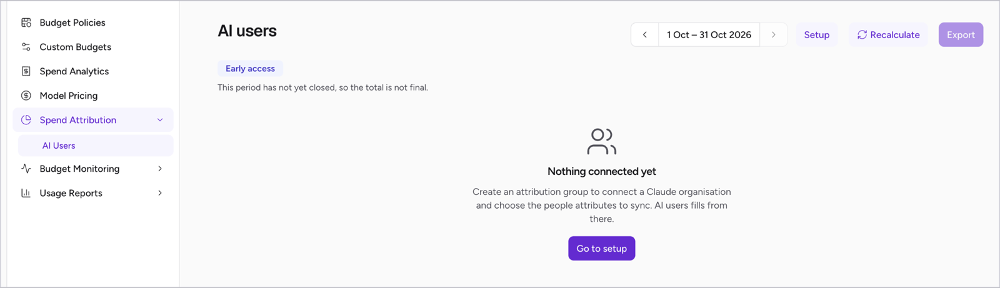

3. Click **Add attribution group**.

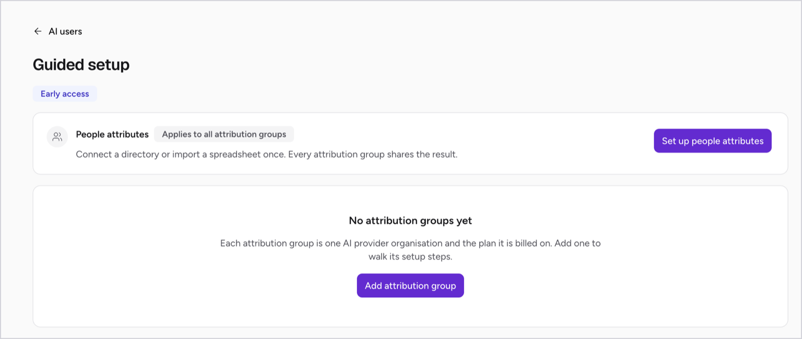

### 2.2 Create the attribution group

1. Enter an **Attribution group name**, for example `Acme AU – Claude Enterprise`.
2. Under **Configuration**, select **Claude Enterprise**.

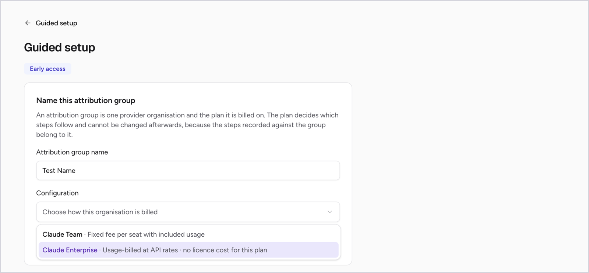

3. Click **Next**.

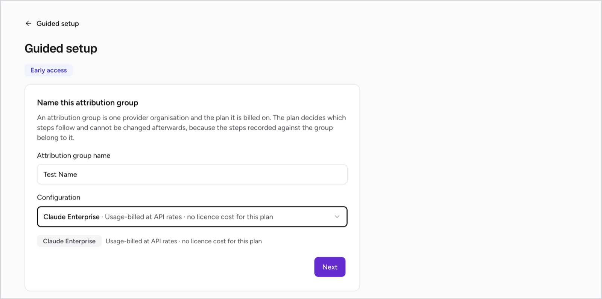

### 2.3 Step 1: Connect Claude

1. Under **Anthropic credential**, select an existing credential, or create a new one.
2. To create one, enter a **Credential name**, paste your **Analytics API key**, and click **Save credential**. Add your Admin key too if you have one.
3. Wait for the connection test to pass, then click **Save and continue**.

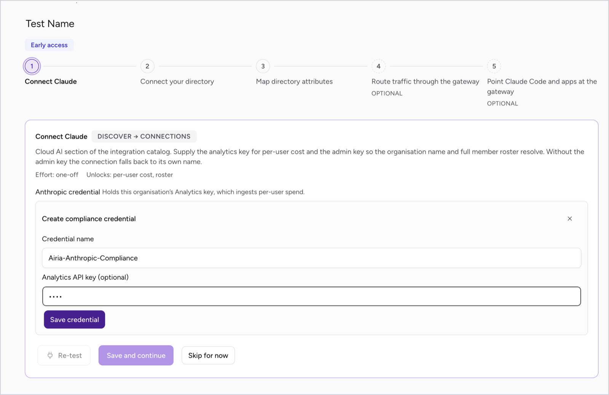

> **If the test fails:** check you used the Analytics key (not the Admin key), then click **Re-test**. If the test shows a warning only, you can choose **Save anyway**.

### 2.4 Step 2: Connect your directory

1. Select **Connect Microsoft Entra ID** or **Upload a CSV**.
2. **Entra ID:** choose or create a Microsoft Graph app credential and test the connection. Attributes then sync automatically (every 24 hours by default).
3. **CSV:** click **Choose a file**, upload your CSV and check the preview.
4. Click **Save and continue**.

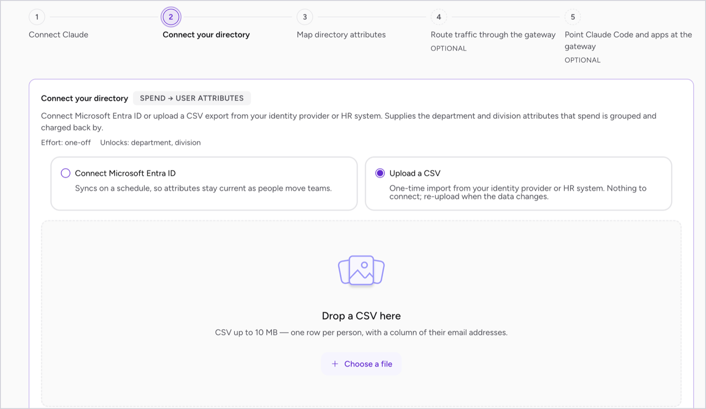

#### CSV requirements

- One row per person, with a column of **work email addresses** (the same address they use for Claude).
- Every other column becomes an attribute, such as department or cost centre.
- Up to 50,000 rows and 10 MB.
- Each new upload replaces the previous one.

Example CSV layout (the first row is the header row):

| mail | department | jobTitle | Cost Center | Office Location |
|---|---|---|---|---|
| jane.smith@yourcompany.com | Finance | Financial Analyst | CC-100 | Melbourne |
| sam.lee@yourcompany.com | Engineering | Software Engineer | CC-200 | Sydney |
| alex.chen@yourcompany.com | Engineering | Engineering Manager | CC-200 | Sydney |

To export users: **Entra ID** or **Google Workspace**: Users → Download users. **Okta or an HR system:** export a user report with an email column. A sample file is available from **Download an example file** on this step.

### 2.5 Step 3: Map directory attributes

1. Switch on **Show as tab** for each attribute you want to report by (for example department and cost centre).
2. Optional: click the **Tab label** to rename it, then press Enter.
3. Click **Save and continue**.

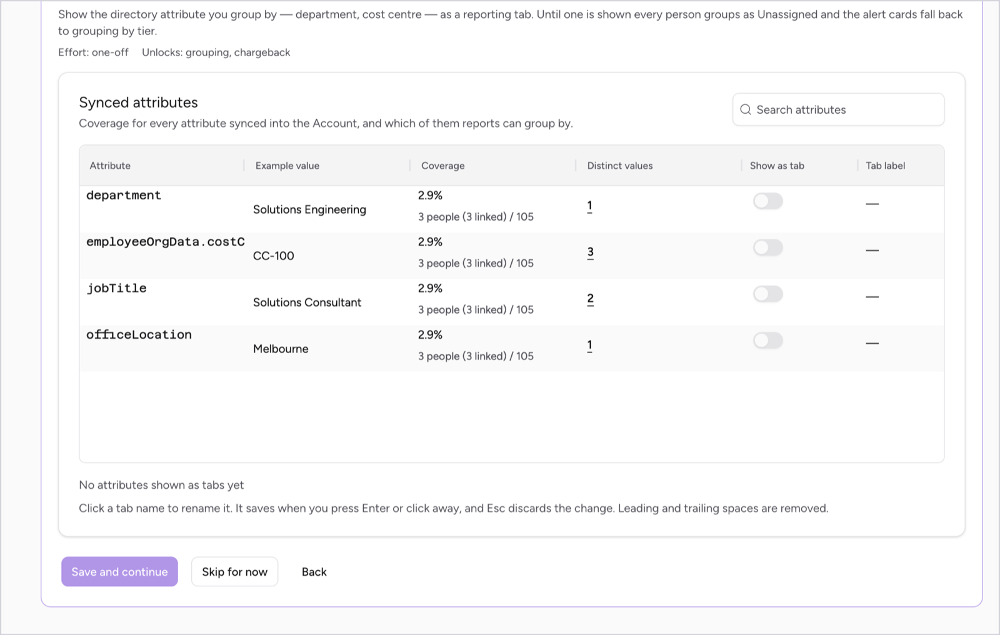

> **Note:** at least one attribute must be switched on. A tab named **department** also fills the Department column on AI Users.

### 2.6 Step 4: Route traffic through the gateway (optional)

1. Open **Gateway configuration** and select the configuration your Claude traffic uses, or click **Or create a new configuration**.

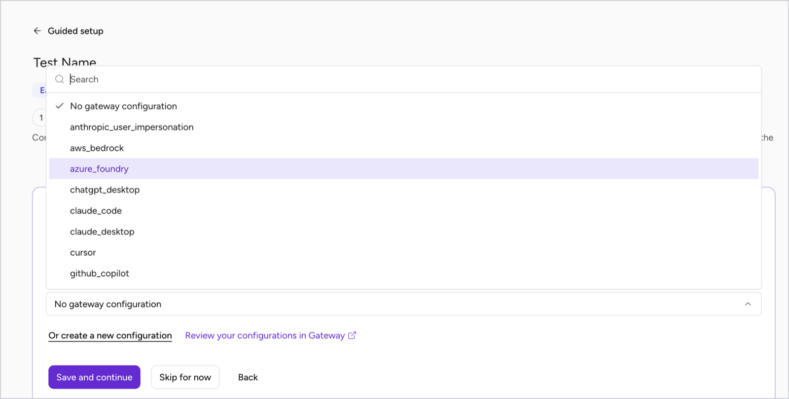

2. Click **Save and continue**.

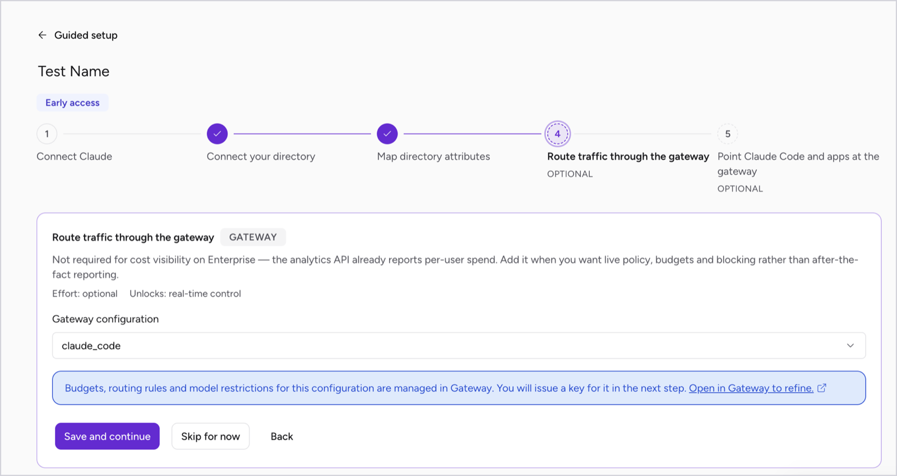

### 2.7 Step 5: Point Claude Code and apps at the gateway (optional)

1. Copy the **Anthropic base URL** shown on screen.
2. Set it as `ANTHROPIC_BASE_URL` in Claude Code, or as `base_url` in the Anthropic SDKs.
3. Use an enabled **Gateway API key** from this page to authenticate. One key covers the whole group.
4. Click **Save and continue** to finish.

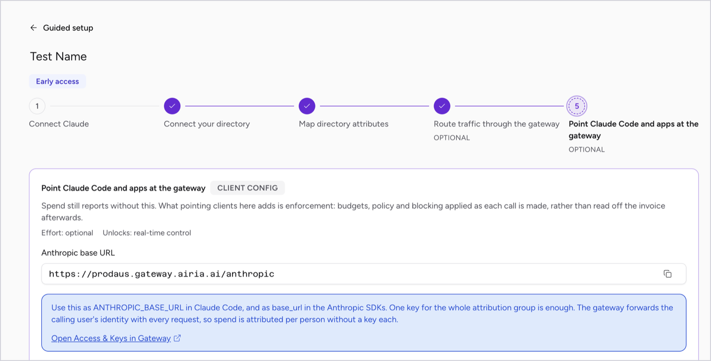

```bash
export ANTHROPIC_BASE_URL="https://prodaus.gateway.airia.ai/anthropic"
```

See [Claude Code Setup](../claude_code/claude_code_setup.md) for the full client configuration.

### 2.8 Confirm the connection

The AI Users page now shows **Connected. First sync pending.** People appear within about an hour, and the previous 90 days are backfilled. Data then refreshes every hour.

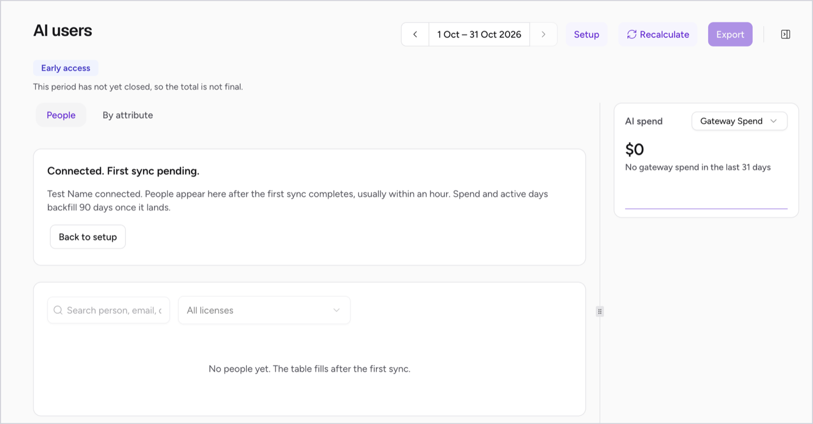

## 3. Set up Claude Team

Team usage is only visible through the Airia gateway, so the gateway steps are required.

1. Follow [2.1](#21-open-guided-setup) and [2.2](#22-create-the-attribution-group), but select **Claude Team** as the configuration.
2. **Step 1 – Create a gateway configuration.** Select or create a configuration (as in [2.6](#26-step-4-route-traffic-through-the-gateway-optional)).
3. **Step 2 – Point Claude Code and apps at the gateway.** Configure the base URL and an enabled API key (as in [2.7](#27-step-5-point-claude-code-and-apps-at-the-gateway-optional)).
4. **Step 3 – Accumulate one full billing month.** No action needed.
5. **Step 4 – Upload the seat invoice.** Upload your latest Anthropic invoice.
6. **Step 5 – Connect your directory** (as in [2.4](#24-step-2-connect-your-directory)), then map attributes (as in [2.5](#25-step-3-map-directory-attributes)).

### Invoice requirements

- **PDF:** the original invoice from Anthropic. Scanned or image-only PDFs are not accepted.
- **CSV:** use the template from the upload dialog. One row per line item, up to 1,000 lines; the lines must add up to the total.
- Upload a new invoice **each month**. Uploading the same invoice number again replaces it.
- If you have more than one Anthropic organisation, upload from the attribution group in Guided setup so the invoice is linked to the right group.

## 4. Reports and insights

Once the first sync completes, go to **Budget → Spend Attribution → AI Users**. Use the arrows beside the date range to change the period. Data refreshes every hour.

### 4.1 People

The **People** tab lists everyone Airia can see using Claude, with their licences, utilisation and spend.

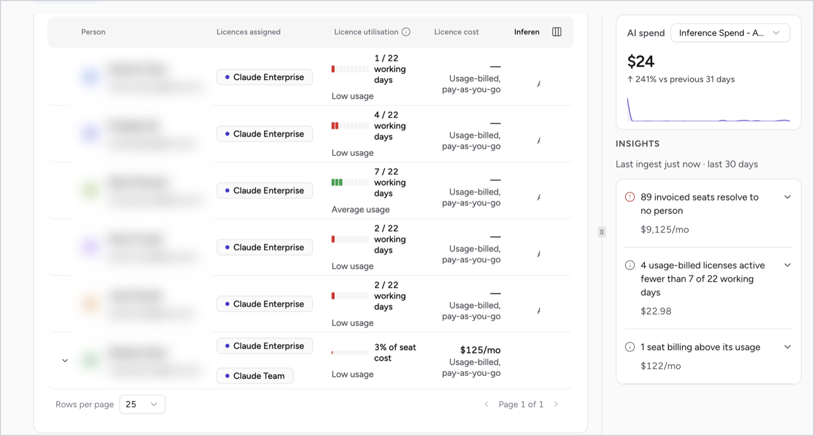

| Column | What it shows |
|---|---|
| Person | Name and email address. |
| Licences assigned | Each Claude licence the person holds. People with more than one licence can be expanded to show each on its own line. |
| Licence utilisation | **Enterprise:** working days with activity, e.g. "4 / 22 working days". **Team:** usage at API rates as a share of the seat cost, e.g. "3% of seat cost". |
| Licence cost | Monthly seat price (Team), or "Usage-billed, pay-as-you-go" (Enterprise). |
| Inference Spend – API | Spend reported by Anthropic. |
| Gateway Spend | Spend measured by the Airia gateway (estimated at API rates). |
| Last seen | When the person was last active, and the source it came from. |

Use the column picker (top right of the table) to show or hide columns, and the search box and licence filter to narrow the list.

#### Utilisation bands

| Band | Range | Typical action |
|---|---|---|
| Unused | 0% | Reclaim the seat |
| Low usage | Below 30% | Review whether the seat is needed, or offer enablement |
| Average usage | 30–79% | No action |
| Fully utilised | 80% or more | Check whether a larger tier is better value |

A dash ("—") means there is nothing to measure against yet, for example no seat price. It does not mean the seat is unused.

### 4.2 AI spend

The **AI spend** panel shows total spend for the period, the change against the previous period and a daily trend. Use the drop-down to switch between **Inference Spend – API** (reported by Anthropic) and **Gateway Spend** (measured by Airia). The two can cover the same usage, so they are shown separately and never added together.

### 4.3 Insights

The **Insights** panel lists issues found in the last 30 days, each with its monthly cost. Expand an insight and click **Review people** to filter the table to the people involved.

| Insight | What it means | What to do |
|---|---|---|
| Invoiced seats resolve to no person | You are paying for seats that no active user matches. | Reclaim unassigned seats at renewal. |
| Seat never used | The person holds a seat but has no usage. | Reclaim or reassign the seat. |
| Seat billed after lapse | The seat is still billed but has had no usage for 14+ days. | Confirm the person still needs it. |
| Seat underused / seat billing above its usage | Usage is below 30% of what the seat costs. | Review the seat, or move the person to usage-based billing. |
| Usage-billed low activity | An Enterprise user was active on fewer than 30% of working days. | Check for enablement or access issues. |
| Tier undersized | A Standard seat is using more than 45% of the Premium price. | Consider upgrading to Premium. |
| Spend unattributed | Spend that matches no licence or directory record. | Check the email matches your directory or CSV. |
| Seat cost unchargeable | The seat holder has no Airia account. | Create an Airia account for the person. |

Click **Dismiss** to hide an insight for your current session.

### 4.4 Person details

Click a person to open their details:

- **Spend by licence:** gateway (estimated) and inference (actual) spend for each licence, plus the seat cost.
- **Budget:** spend this cycle. Click **Edit budget** to set a budget for the person.
- **Sources:** where Airia found the person, such as Claude Enterprise API analytics, the gateway, an invoice or your directory.
- **View history:** daily usage over time.

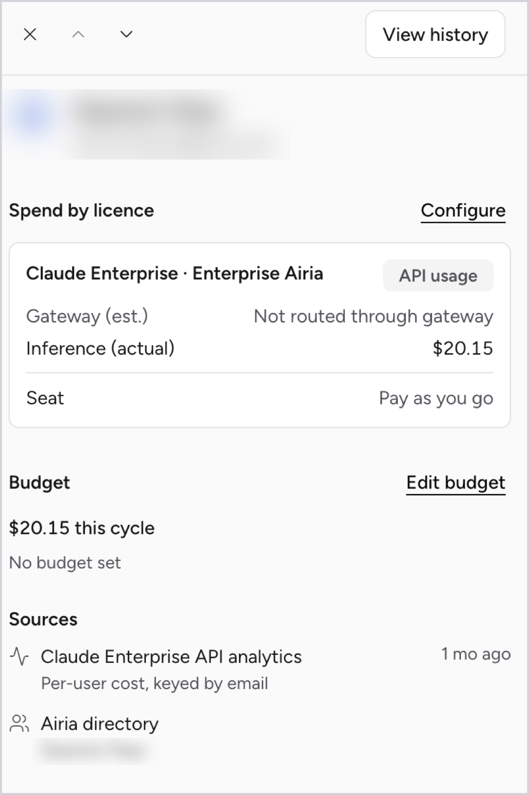

### 4.5 Spend by attribute

The **By attribute** tab groups spend by the attributes you switched on in setup step 3, such as department or cost centre. Each row shows gateway spend, API spend, licence cost, total and share of total. Use it for chargeback and departmental reporting.

- **No {attribute}:** people without a value for that attribute.
- **Not user-attributed:** spend from service accounts and shared keys.

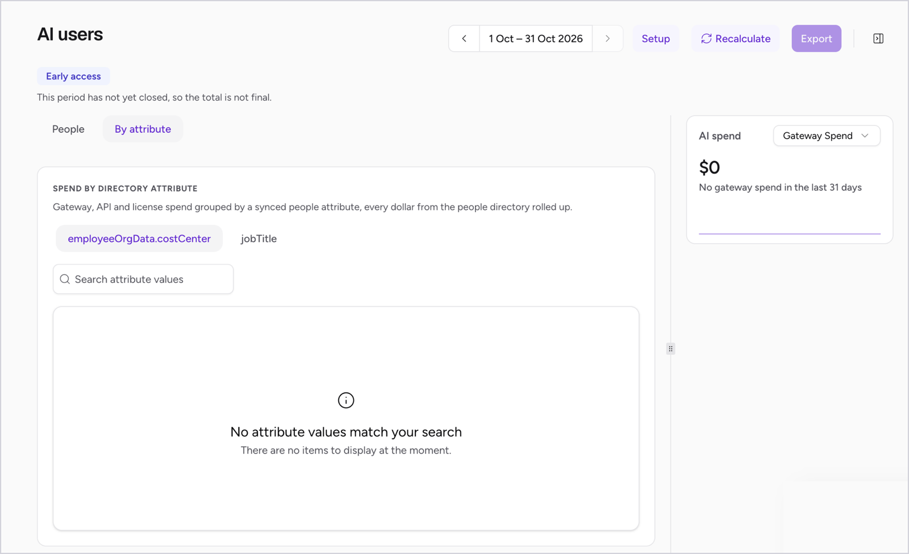

## 5. Troubleshooting

| Problem | What to do |
|---|---|
| No people after an hour or two | Open the group in Guided setup and re-test the credential in step 1. |
| Anthropic key rejected | Enterprise needs the Analytics key (`read:analytics`, created in claude.ai), not the Admin key. |
| "Organisation already connected" | Each Anthropic organisation can only be in one group. Open the existing group instead. |
| Attributes missing for some people | The email in your directory or CSV must match the one used for Claude. Check coverage in step 3. |
| Everyone shows as "Unassigned" | Switch on at least one attribute under **Show as tab** in step 3. |
| Claude Team usage missing | Check users are configured with the gateway base URL and an enabled API key. |
| Utilisation shows "—" | No seat price yet. Upload your seat invoice (Team). |
| Data looks out of date | Data refreshes hourly. Click **Recalculate** on AI Users to rebuild recent gateway data. |
